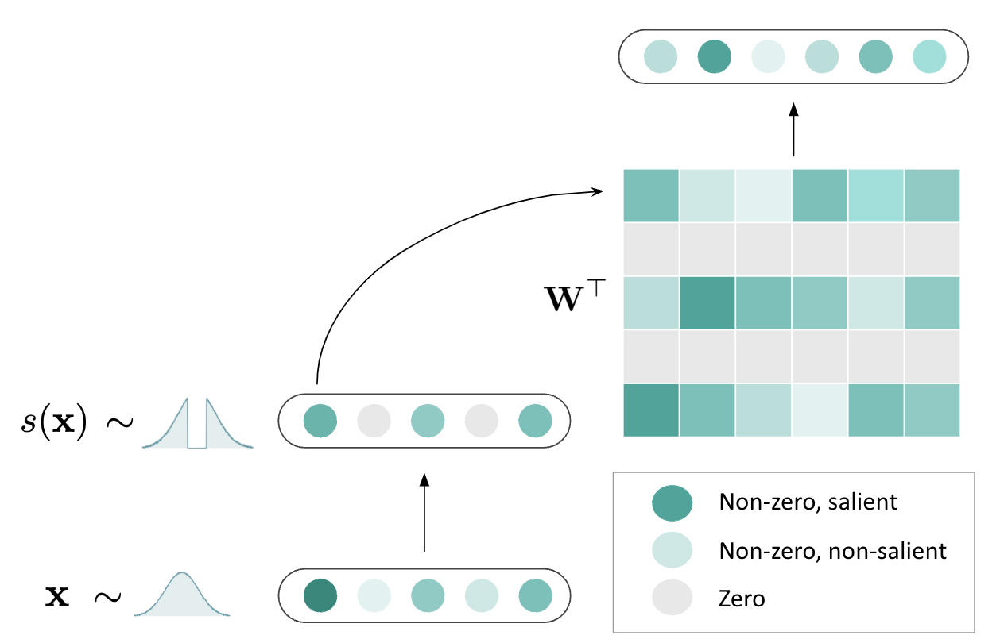

# Training-Free Acivation Sparsity in Large Language Models

[[Paper](https://www.arxiv.org/abs/2408.14690)][[Blog](https://www.together.ai/blog/teal-training-free-activation-sparsity-in-large-language-models)]


TEAL induces up to 40-50% model-wide activation sparsity in modern LLMs with minimal degradation, resulting in an up to 1.53-1.8x speedup in single-batch decoding.

<div align="center">
    
  </a>
</div>

The current release supports:
- FP16 inference for Llama-2/3 models using uniform sparsities
- Accuracy evaluation for Llama-2/3 and Mistral models using uniform and block-wise greedy sparsities


## News

- [08/2024] 🔥 Arxiv release!

## Abstract

Activation sparsity can enable practical inference speedups in large language models (LLMs) by reducing the compute and memory-movement required for matrix
multiplications during the forward pass. However, existing methods face limitations that inhibit widespread adoption. Some approaches are tailored towards
older models with ReLU-based sparsity, while others require extensive continued
pre-training on up to hundreds of billions of tokens. This paper describes TEAL
(**T**raining-Fre**e** **A**ctivation Sparsity in **L**LMs), a simple training-free method that
applies magnitude-based activation sparsity to hidden states throughout the entire
model. TEAL achieves 40-50% model-wide sparsity with minimal performance
degradation across Llama-2, Llama-3, and Mistral families, with sizes varying
from 7B to 70B. We improve existing sparse kernels and demonstrate wall-clock
decoding speed-ups of up to 1.53× and 1.8× at 40% and 50% model-wide sparsity.
TEAL is compatible with weight quantization, enabling further efficiency gains.


## Contents

- [Install](#Install)
- [Demo](#Demo)
- [Inference Usage](#Inference-Usage)
- [Accuracy Usage](#Accuracy-Usage)
- [Citation](#citation)

## Install

1. Clone the repo and navigate to TEAL:

```
git clone https://github.com/FasterDecoding/TEAL
cd TEAL
```

2. Set up environment:


```bash
conda create -yn teal python=3.11
conda activate teal

pip install -e .
```

3. (Optional) If you want to calibrate thresholds for your own models, or run accuracy evals for models, install the following dependency:

  ```bash
  pip install -e ".[eval]"
  ```

## Inference Usage

For easy usage, we provide calibrated thresholds for Llama-2/3 and Mistral models in `models/` folder.

1. Navigate to gpt-fast:

```bash
cd gpt-fast
```

2. Download model weights and convert to gpt-fast format (`scripts/prepare.sh`):
```bash
python scripts/download.py --repo_id meta-llama/Llama-2-7b-hf --path $SAVE_PATH && python scripts/convert_hf_checkpoint.py --checkpoint_dir $SAVE_PATH/meta-llama/Llama-2-7b-hf
```

3. Run dense inference (`scripts/base_run.sh`):

```bash
CUDA_VISIBLE_DEVICES=0 python generate.py \
    --compile \ 
    --checkpoint_path $SAVE_PATH/meta-llama/Llama-2-7b-hf/model.pth \ 
    --interactive
```

4. Run sparse inference! (`scripts/run.sh`):
```bash
CUDA_VISIBLE_DEVICES=0 python generate.py \
    --compile \ 
    --checkpoint_path $SAVE_PATH/meta-llama/Llama-2-7b-hf/model.pth \ 
    --hist_path ../models/Llama-2-7B/histograms \ 
    --sparsity 0.5 \ 
    --interactive
```

To benchmark inference speed, remove `--interactive`.

Please treat the current inference implementation as just a proof of concept! There are a few limitations:
- Only FP16 is supported, as Triton does not currently support BF16 `atomic_add`.
- Block-wise greedy sparsities are not currently supported (expect to have this very soon!).
- Quantized sparse kernels are not currently supported (though, would love a PR!).
- Speculative decoding is untested

### Accuracy Usage

1. Navigate to TEAL:
```bash
cd TEAL
```

1. Construct histograms for threshold calibration (`scripts/grab_acts.bash`):

```bash
CUDA_VISIBLE_DEVICES=0 python teal/grab_acts.py \  
  --model_name meta-llama/Llama-2-7b-hf \ 
  --output_path $OUTPUT_PATH
```

2. Run perplexity test (`scripts/ppl_test.bash`):

```bash
CUDA_VISIBLE_DEVICES=0 python teal/ppl_test.py \
--model_name meta-llama/Llama-2-7b-hf \
--teal_path $OUTPUT_PATH \
--sparsity 0.5
```

3. (Optional) Run block-wise greedy optimization (`scripts/greedyopt.bash`):

```bash
CUDA_VISIBLE_DEVICES=0 python teal/greedyopt.py \
  --model_name meta-llama/Llama-2-7b-hf \
  --model_type Llama-2-7B \
  --teal_path $OUTPUT_PATH \
  --target_sparsity 0.9 \
  --base_step_size 0.05 \
  --last_fraction 0.25
```

```bash
CUDA_VISIBLE_DEVICES=0 python teal/ppl_test.py \
  --model_name meta-llama/Llama-2-7b-hf \
  --teal_path $OUTPUT_PATH \
  --sparsity 0.5 \
  --greedy_flag
```

## Citation

If you find TEAL useful, please consider citing:

```
@misc{liu2024trainingfreeactivationsparsitylarge,
      title={Training-Free Activation Sparsity in Large Language Models}, 
      author={James Liu and Pragaash Ponnusamy and Tianle Cai and Han Guo and Yoon Kim and Ben Athiwaratkun},
      year={2024},
      eprint={2408.14690},
      archivePrefix={arXiv},
      primaryClass={cs.CL},
      url={https://arxiv.org/abs/2408.14690}, 
}
```
